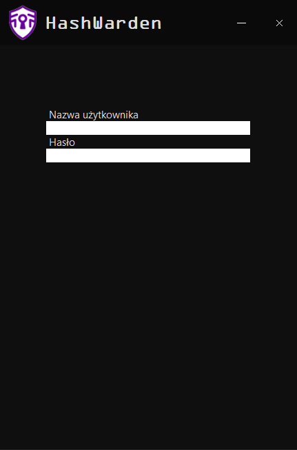
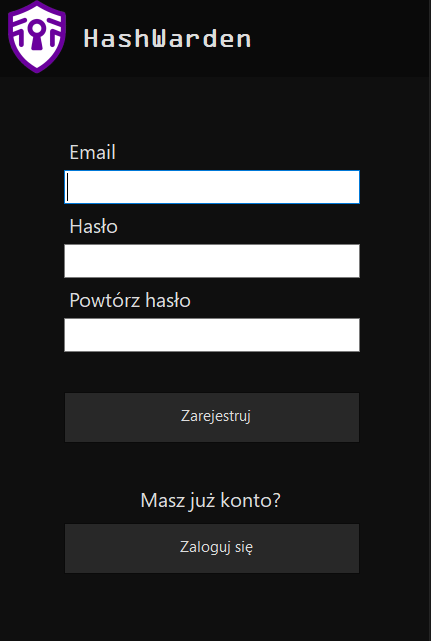
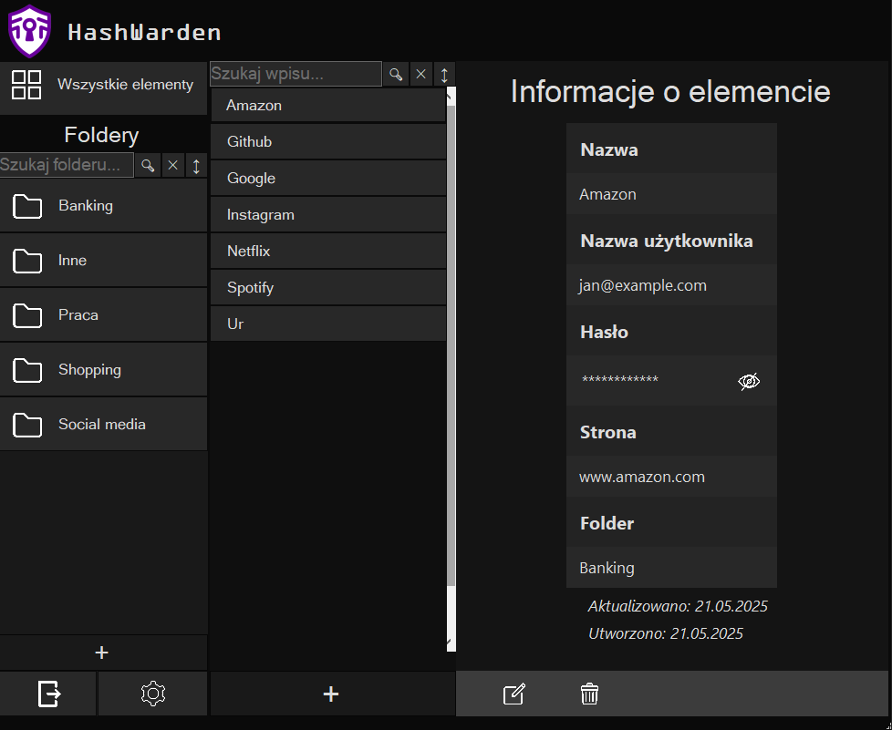
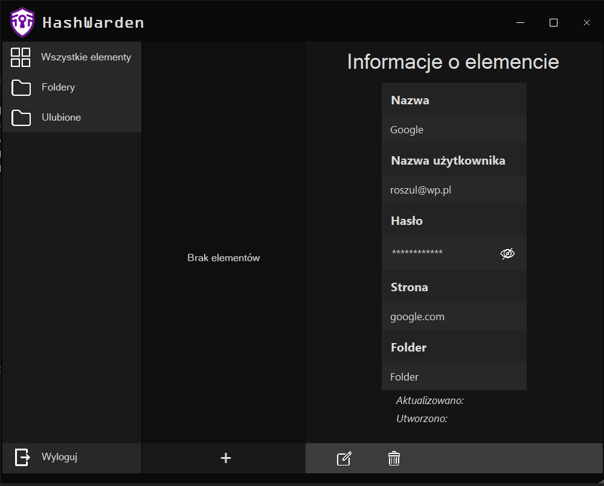

# HashWarden

## Opis aplikacji

HashWarden to aplikacja desktopowa służąca do zarządzania hasłami użytkownika. Umożliwia tworzenie i organizowanie zapisanych danych logowania w folderach, przypisywanie ich do kont użytkowników oraz bezpieczne przechowywanie haseł w formie zaszyfrowanej. Aplikacja została zbudowana w technologii C# przy użyciu Windows Forms oraz Entity Framework Core w podejściu Code First. Jako system bazodanowy wykorzystano PostgreSQL.

## Funkcje

- Logowanie
- Zapisywanie kont
- Przechowywanie szyfrowanych haseł
- Sortowanie wpisów po folderach
- Zarządzanie hasłami

## Opis bazy danych

Baza danych składa się z trzech głównych tabel: `Users`, `Folders` i `Passwords`.

| Tabela     | Kolumny                                | Relacje                                      |
|------------|----------------------------------------|----------------------------------------------|
| Users      | Id, Email, MasterHash, Salt, CreatedAt | 1:N z Folders, 1:N z Passwords               |
| Folders    | Id, FolderName, UserId                 | N:1 z Users, 1:N z Passwords                 |
| Passwords  | Id, Title, UserName, ServiceUrl, EncryptedPassword, Iv, CreatedAt, UpdatedAt, FolderId, UserId | N:1 z Users, N:1 z Folders |

## Wymagania

- .NET 6.0+
- PostgreSQL 12+

## Konfiguracja

1. Stworzyć plik `appsettings.json` w głównym folderze projektu.

2. W pliku `appsettings.json` należy dodać ciąg połączenia do bazy PostgreSQL (zmienić hasło i w razie potrzeby nazwę użytkownika):

```json
{
  "ConnectionStrings": {
    "DefaultConnection": "Host=localhost;Database=HashWardenDB;Username=postgres;Password=yourpassword"
  }
}
```

3. Wykonać migrację bazy danych:  
W terminalu:
```bash
    dotnet ef migrations add Init
    dotnet ef database update
```

Lub w konsoli Packet Manager:
```bash
    Add-Migration Init
    Update-Database
```

4. Uruchomić aplikację w terminalu:
```bash
    dotnet run
```

## Widoki

### Logowanie

### Rejestracja

### Główny panel

### Zapisane hasło

