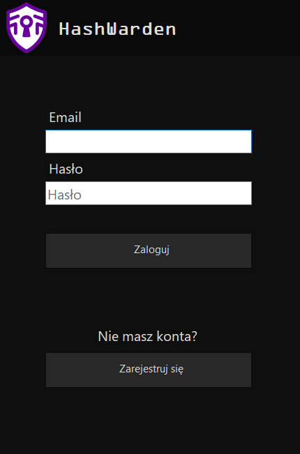

# HashWarden

## Opis aplikacji

**HashWarden** to aplikacja desktopowa służąca do zarządzania hasłami użytkownika. Umożliwia tworzenie i organizowanie zapisanych danych logowania w folderach, przypisywanie ich do kont użytkowników oraz bezpieczne przechowywanie haseł w formie zaszyfrowanej. Aplikacja została zbudowana w technologii C# przy użyciu Windows Forms oraz Entity Framework Core w podejściu Code First. Jako system bazodanowy wykorzystano PostgreSQL.

## Funkcje

- **Uwierzytelnianie użytkownika**
- **Przechowywanie szyfrowanych haseł**
- **Organizacja folderów**
- **Zarządzanie hasłami**
- **Zarządzanie sesją**
- **Eksport/import danych**
- **Wyszukiwanie wpisów**
- **Zmiana połączenia w aplikacji**

## Implementacja Bezpieczeństwa

Bezpieczeństwo danych użytkownika jest kluczowym aspektem aplikacji HashWarden. Implementacja obejmuje:

### Haszowanie Hasła Głównego

**Algorytm: Argon2**  

Proces: Hasło główne użytkownika jest haszowane przy użyciu algorytmu Argon2 z unikalną solą dla każdego użytkownika. Hasz i sól są przechowywane w bazie danych.

### Szyfrowanie Haseł

**Algorytm: AES (Advanced Encryption Standard)**  

Proces: Hasła użytkownika są szyfrowane przy użyciu algorytmu AES z unikalnym wektorem inicjalizacyjnym (IV) dla każdego hasła. Klucz szyfrowania jest pochodną hasła głównego użytkownika.

### Zarządzanie Kluczem Sesji

**Komponent: SessionKeyManager**  

Funkcja: Po pomyślnym uwierzytelnieniu, aplikacja generuje i przechowuje klucz sesji w pamięci, umożliwiając szyfrowanie i deszyfrowanie haseł podczas sesji użytkownika. Klucz sesji jest usuwany z pamięci po wylogowaniu lub zamknięciu aplikacji.

## Technologie

* **Język programowania:** C# (.NET)

* **Interfejs użytkownika:** Windows Forms

* **Baza danych:** Entity Framework z relacyjnym modelem danych

* **Szyfrowanie:** AES dla danych, Argon2 dla haseł

* **Serializacja:** JSON dla importu/eksportu danych

## Opis bazy danych

Baza danych składa się z trzech głównych tabel: `Users`, `Folders` i `Passwords`.

### Tabela Users

| Atrybut      | Typ danych    | Opis                                       |
| ------------ | ------------- | ------------------------------------------ |
| `Id`         | INT (serial)  | Klucz główny                               |
| `Email`      | string        | Adres e-mail użytkownika                   |
| `MasterHash` | string        | Hasz hasła głównego (Argon2)               |
| `Salt`       | string        | Unikalna sól używana do haszowania         |
| `Iv`         | string        | Wektor inicjalizacyjny dla szyfrowania AES |

### Tabela Folders

| Atrybut      | Typ danych   | Opis                                           |
| ------------ | ------------ | ---------------------------------------------- |
| `Id`         | INT (serial) | Klucz główny                                   |
| `FolderName` | string       | Nazwa folderu                                  |
| `UserId`     | INT          | Klucz obcy → Users(Id)                         |

### Tabela Passwords

| Atrybut             | Typ danych    | Opis                                           |
| ------------------- | ------------- | ---------------------------------------------- |
| `Id`                | INT (serial)  | Klucz główny                                   |
| `Title`             | string        | Tytuł lub opis hasła                           |
| `EncryptedPassword` | string        | Zaszyfrowane hasło                             |
| `Iv`                | string        | Wektor inicjalizacyjny dla szyfrowania AES     |
| `UserId`            | INT           | Klucz obcy → Users(Id)                         |
| `FolderId`          | INT           | Klucz obcy → Folders(Id)                       |

### Relacje
* **User -< Folder** (1 - N): Jeden użytkownik może posiadać wiele folderów.

* **Folder -< Password** (1 - N): Jeden folder może zawierać wiele haseł.

* **User -< Password** (1 - N): Jeden użytkownik może posiadać wiele haseł.

## Struktura projektu
Projekt HashWarden jest zorganizowany zgodnie ze standardami .NET:

* **Forms**: Komponenty interfejsu użytkownika (LoginForm, MainForm, AddPasswordForm, itp.)

* **Models**: Modele danych Entity Framework (User, Password, Folder) oraz model eksportu haseł(ExportModel)

* **Data**: Kontekst bazy danych i logika inicjalizacji (HashWardenDbContext, DatabaseSeeder)

* **Utils**: Klasy pomocnicze i logika biznesowa (EncryptionProvider, SessionKeyManager)

* **Images**: Ikony aplikacji i zasoby interfejsu użytkownika

* **Seeders**: Seedery do zapełniania bazy danych

* **Migrations**: Automatycznie generowane pliki migracji EF Core służące do tworzenia i aktualizacji schematu bazy danych

Punkt wejścia aplikacji to **Program.cs**, który inicjalizuje kontekst bazy danych, stosuje wszelkie oczekujące migracje, inicjalizuje dane i uruchamia formularz logowania.

## Wymagania

- .NET 6.0+
- PostgreSQL 12+

## Konfiguracja

1. Stworzyć plik `appsettings.json` w głównym folderze projektu.

2. W pliku `appsettings.json` należy dodać ciąg połączenia do bazy PostgreSQL (zmienić hasło i w razie potrzeby nazwę użytkownika):

```json
{
  "ConnectionStrings": {
    "DefaultConnection": "Host=localhost;Database=HashWardenDB;Username=postgres;Password=yourpassword"
  }
}
```
3. Pobrać wymagane narzędzia:
W terminalu:
```bash
    dotnet restore
```
lub

```bash
    dotnet add package Konscious.Security.Cryptography.Argon2 --version 1.3.1
    dotnet add package Microsoft.EntityFrameworkCore --version 9.0.5
    dotnet add package Microsoft.EntityFrameworkCore.Tools --version 9.0.5
    dotnet add package Microsoft.Extensions.Configuration --version 9.0.5
    dotnet add package Microsoft.Extensions.Configuration.Json --version 9.0.5
    dotnet add package Npgsql.EntityFrameworkCore.PostgreSQL --version 9.0.4
```

4. Wykonać migrację bazy danych:  
W terminalu:
```bash
    dotnet ef migrations add Init
    dotnet ef database update
```

Lub w konsoli Packet Manager:
```bash
    Add-Migration Init
    Update-Database
```

5. Uruchomić aplikację w terminalu:
```bash
    dotnet run
```
## Rozwiązywanie problemów

### Ogólne problemy

#### Zawieszenie się aplikacji przy usuwaniu zaimportowanego rekordu
**Przyczyny**
1. Błąd sterownika Npgsql

**Rozwiązania**
1. Poczekaj aż aplikacja zacznie odpowiadać
2. Zrestartuj aplikację

### Problemy z połączeniem do bazy danych

#### Błąd: "Could not connect to server"
**Rozwiązania:**
1. Sprawdź czy serwis PostgreSQL jest uruchomiony
2. Zweryfikuj parametry połączenia w appsettings.json
3. Sprawdź ustawienia firewall
4. Upewnij się, że port 5432 jest dostępny

#### Błąd: "Password authentication failed"
**Rozwiązania:**
1. Zweryfikuj nazwę użytkownika i hasło
2. Sprawdź uprawnienia użytkownika w PostgreSQL
3. Upewnij się, że użytkownik ma dostęp do bazy HashWardenDB

### Problemy z migracjami

#### Błąd: "No migrations were applied"
**Rozwiązania:**
1. Usuń folder Migrations i utwórz migrację ponownie
2. Sprawdź czy connection string jest poprawny
3. Uruchom `dotnet ef database drop` i `dotnet ef database update`

### Problemy z szyfrowaniem

#### Błąd: "Unable to decrypt password"
**Przyczyny:**
1. Uszkodzone dane w bazie
2. Nieprawidłowy klucz sesji
3. Zmiana hasła głównego bez aktualizacji haseł

**Rozwiązania:**
1. Wyloguj się i zaloguj ponownie
2. Sprawdź integralność danych w bazie

## Przypadki brzegowe

### Logowanie

* **Logowanie z nieistniejącym emailem:** Aplikacja wyśiwetla błąd informujący o nieprawidłowym polu email lub hasła (bez rozróżnienia dla bezpieczeństwa)
* **Logowanie z pustym polem email lub hasła:** Aplikacja wyświetla błąd proszący o uzupełnienie pól
* **Przekroczenie długości hasła lub emaila (poprzez ominięcie ograniczeń frontendowych):** Aplikacja wyświetla stosowny błąd o przekroczeniu długości pola
* **Użycie nieprawidłowego formatu email:** Aplikacja wyświetla stosowny błąd

### Rejestracja

* **Rejestracja z istniejącym adresem email:** Aplikacja wyświetla błąd o istnieniu takiego emaila w bazie
* **Użycie nieprawidłowego formatu email:** Aplikacja wyświetla stosowny błąd
* **Za krótkie hasło:** Aplikacja wyświetla błąd o za krótkim haśle
* **Hasło niespełniające wymagań(>5 znaków, przynajmniej jedna wielka litera, przynajmniej jeden znak specjalny):** Aplikacja wyświetla błąd o złym formacie hasła
* **Niezgadzajace się hasła:** Aplikacja informuje o niezgodności hasła z powtórzonym hasłem 

### Dodawanie i edycja haseł

* **Puste pola:** Aplikacja wyświetla błąd o braku danych w polach tekstowych
* **Zbyt długi tytuł, adres strony, nazwa użytkownika, hasło:** Aplikacja wyświetla stosowny błąd
* **Dodawanie haseł o tych samych wartościach:** Weryfikacja duplikatu na podstawie klucza (nazwa użytkownika + adres strony), jeśli powtórzenie, wyświetlenie stosownego błędu
* **Dodawanie hasła na koncie użytkownika bez folderów:** Brak konfliktu

### Foldery

* **Pusta nazwa:** Aplikacja wyświetla błąd o braku podanej nazwy
* **Zbyt długa nazwa:** Aplikacja wyświetla stosowny błąd
* **Usunięcie folderu zawierającego hasła:** Folder zostaje usunięty razem z zawartymi w nim hasłami
* **Stworzenie folderu o takiej samej nazwie:** Błąd o duplikacie

### Import / eksport

* **Import pustego pliku:** Wyświetlenie błędu o pustym pliu
* **Import pliku z błędnym formatem:** Wyświetlenie błędu o braku pliku lub niepoprawnym formacie

### Inne

* **Brak klucza sesji:** Program przy próbie podejrzenia wrażliwych danych zapyta o wpisanie hasła głównego
* **Zamknięcie aplikacji bez wylogowania (co się dzieje z kluczem sesji):** Zostaje wywołana funkcja ClearKey() czyszcząca klucz sesji


## Widoki

### Logowanie

### Rejestracja

### Główny panel

### Ustawienia

### Dodawanie folderu

### Dodawanie wpisu

### Edycja wpisu

### Zmiana połączenia z bazą
